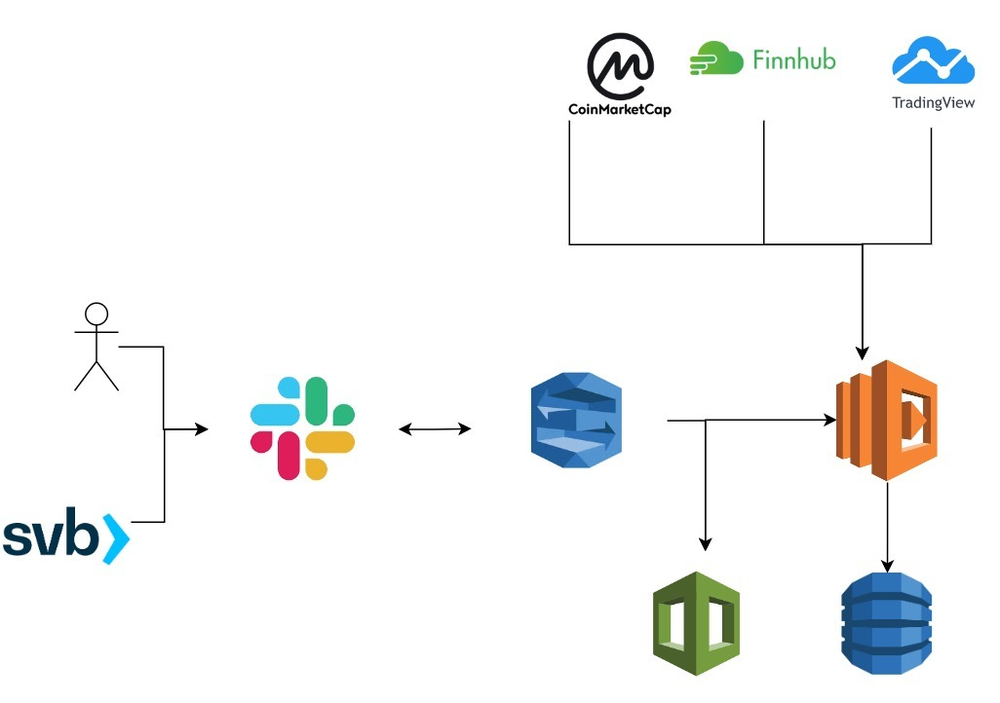
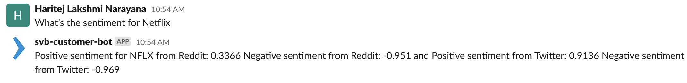
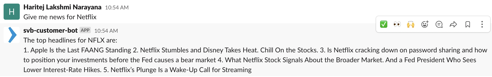

# aws-lex-chatbot
Chatbot Built Using Aws Lex to Help Customers Make Financial Decisions

## Functionalities
- Understand basic human conversations to translate to financial questions
- Gets financial asset prices like stocks and crypto
- Renders charts on the chat
- Can easily be integrated with any slack channel
- Gets latest news for any stock or cryptocurrency
- Fetches aggregated sentiment of a stock/cryptocurrency from twitter and reddit
- Provides financials of a stock
- Users and Financial institutions can use the bot to track customer service requests by moving logs from cloudfront to DynamoDB

## System Design

## Chatbot Screenshots

Sentiment of a Stock

News headlines of a Stock

Providing Financials of a Stock

